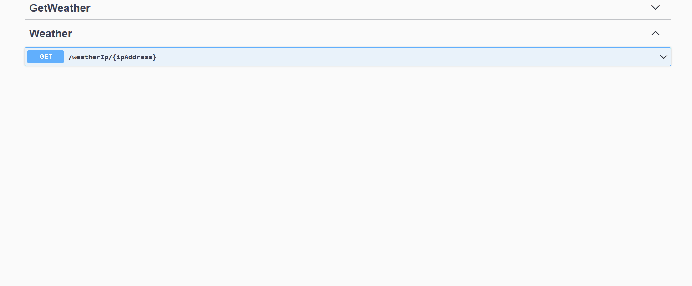

# Weather API

The WeatherByIp API is a RESTful web service that provides weather information based on the IP address of the request originator. It utilizes non-commercial, third-party services to perform geolocation and retrieve current weather conditions using the coordinates of the IP.
Functionality

  <b>WeatherIp development mode</b> 
  

  <b>Deployed example</b> 
  

## The API offers the following features:

- `/weather` - Send a GET request to retrieve the current weather data based on the IP address of the request originator. The API performs a geolocation search using a third-party IP-to-location provider and retrieves the weather information using the coordinates of the IP. If successful, it returns the weather data in the response.

- `/weatherIp/{ipAddress}` - Send a GET request to check the current weather for a specific IP address. The API validates the provided IP address, performs a geolocation search using a third-party IP-to-location provider, and retrieves the weather information using the coordinates of the IP. If successful, it returns the weather data in the response.

- `/clearDb` - Send a DELETE request to clear the database. This endpoint deletes all location and weather data stored in the database.

## If you want to try out the application

**API is deployed at [http://edbe.somee.com](http://edbe.somee.com/weather)**

- Prerequisites:

  - Ensure you have the .NET runtime environment installed on your machine.
  - Verify that you have the necessary dependencies for the application.

- Clone the repository or download the source code from the provided Git repository link.

- Build the application using the appropriate build command for your environment.

- Run the application using the appropriate command for your environment. This will start the API and make it available for requests.

- Try out `/weatherIp` and `/clearDb`:
  - Send a GET request to http://localhost:5000/weatherIp/{ipAddress}, replacing {ipAddress} with the desired IP address to check. The API will validate the provided IP address, perform a geolocation search, and retrieve the weather data for the specified location.
  - Send a DELETE request to http://localhost:5000/clearDb to clear the database. This will delete all location and weather data stored in the database.

If you want to use the `/weather` endpoint, you will need to deploy your application to a server. Deploying the application will make the `/weather` endpoint accessible to other users.

## Database System Implementation

The WeatherByIp API implements a local SQLite database system to store data from the third-party providers.

## URLs of the used third-party APIs:

- This API utilises https://ipinfo.io IP-to-location services and implements its response data in its functionality.

- This API utilises https://api.open-meteo.com location-to-weather services and implements its response data in its functionality.

Feel free to reach out if you have any further questions or need additional assistance.
